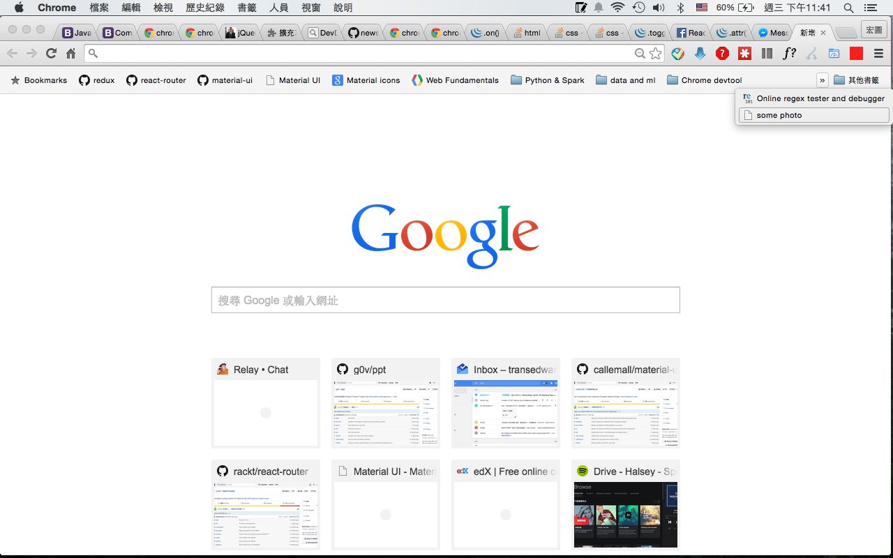

facebook-marks
===============================
## Motivation
There are times I wish I could find some specific post but just can't remember where it is.

I realize we need a better way to **mark** the post (not just saved link or added to later),

So I come up with this idea - just integration with our familiar usage - *Chrome BookMarks*

## Demo

## Installation
To be added.

## Development
You should do this before editing any code to see how it works.

1. `git clone https://github.com/transedward/facebook-marks.git`
2. `npm install`
3. `npm install gulp -g`
  - If there is problem with missing gulpfile, uninstall `npm uninstall gulp -g` and install again. You have probably old non-babel compatible version

4. Run `gulp` which will start webpack-dev-server
5. In Chrome open `chrome://extensions/`
6. Check `Developer mode`
7. Click on `Load unpacked extension`
8. Add facebook-marks/build
9. Now you can check background script via link in extension `Inspect views: background page`
10. Navigate to https://www.facebook.com/ and open development tools and console.
11. You can edit your codebase with almost 100% hot/full reload support.

## Build
1. run `gulp -p`
2. It will compile scripts, styles and other assets into release/build/
3. It will make chrome extension into release/build.crx with certificate release/build.pem
